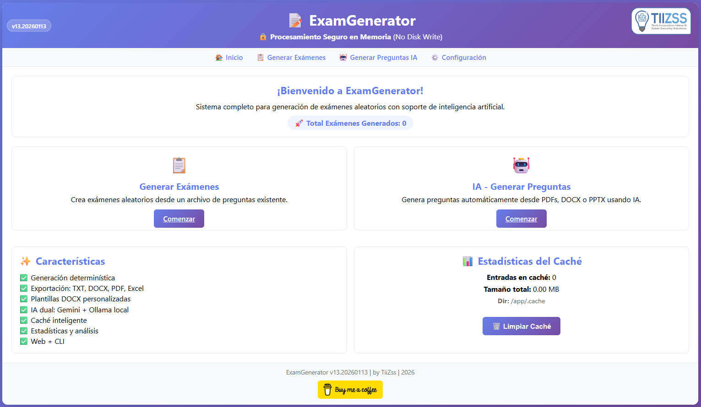

# 🎓 ExamGenerator: Generador Avanzado de Exámenes Aleatorios

[](https://github.com/TiiZss/ExamGenerator/releases)
[](https://www.python.org)
[](LICENSE)
[](https://www.docker.com/)
[](https://flask.palletsprojects.com)
[](https://github.com/TiiZss/ExamGenerator)

[](https://github.com/TiiZss/ExamGenerator/stargazers)
[](https://github.com/TiiZss/ExamGenerator/issues)
[](docs/CHANGELOG.md)
[](https://www.buymeacoffee.com/tiizss)



---

Un sistema completo y profesional en Python para generar exámenes aleatorios con múltiples formatos de salida, plantillas personalizables, generación de preguntas asistida por IA (Google Gemini & Ollama), y interfaz web moderna con Docker.

## 🌟 **Características Principales**

### 🌐 **Interfaz Web v13**
- **🎨 Interfaz Moderna & Compacta**: Diseño UI refinado, padding optimizado y layouts alineados.
- **🔢 Contador Persistente**: Rastreo global de exámenes generados (data/stats.json).
- **📝 Generación Web**: Crear exámenes y preguntas sin usar la terminal
- **⚙️ Configuración API Keys**: Página web para gestionar Google Gemini API key
- **🤖 Dual AI Engine**: Soporte para Google Gemini 2.5 y Ollama local
- **⚡ Caché Inteligente**: Sistema de caché con TTL para evitar regeneración
- **📤 Descarga Directa**: Descarga automática de archivos ZIP
- **📊 Barra de Progreso**: Visualización en tiempo real de generación de exámenes y preguntas
- **🎯 Interfaz Compacta**: Diseño optimizado sin scroll innecesario
- **⏱️ Tiempo Personalizable**: Configura minutos por pregunta con vista previa de tiempo total
- **🎯 Fácil de Usar**: Sin conocimientos técnicos requeridos

### 📋 **Generador Principal (eg.py)**
- **🎲 Aleatorización Inteligente**: Mezclado de preguntas y opciones con semillas consistentes
- **📄 Múltiples Formatos**: Exportación en TXT, DOCX, PDF, o combinados
- **🎨 Sistema de Plantillas**: Soporte completo para plantillas DOCX con 15+ placeholders
- **📁 Organización Automática**: Creación de carpetas organizadas por tema de examen
- **📊 Respuestas Múltiples**: Exportación en Excel, CSV, HTML, y TXT
- **⏱️ Cálculo de Tiempo**: Estimación automática de duración del examen
- **📈 Estadísticas**: Análisis de distribución de respuestas y balance
- **✅ Validaciones**: Sistema robusto de validación de datos
- **📝 Logging**: Sistema de logging profesional con colores

### 🤖 **Generador con IA (qg.py)**
- **🧠 IA Dual**: Soporte para Google Gemini 2.5 (cloud) y Ollama (local)
- **📦 Chunking Automático**: Genera cualquier cantidad de preguntas (divide en chunks de 10-15)
- **📑 Múltiples Formatos**: Procesamiento de PDF, DOCX, y PPTX
- **🔍 Extracción Inteligente**: Análisis contextual de contenido
- **⚡ Caché Inteligente**: Evita regenerar preguntas idénticas (TTL 7 días)
- **📝 Formato AIKEN**: Genera preguntas con exactamente 4 opciones
- **🔐 Seguridad**: Gestión segura de API keys via web o .env

### 🐳 **Docker Stack v12**
- **3 Contenedores**: ExGen-Web (Flask), ExGen-App (CLI), ExGen-Ollama (IA Local)
- **Hot-Reload**: Código montado como volúmenes para desarrollo ágil
- **Ollama Integrado**: IA local preconfigurada (phi3:mini) sin configuración adicional
- **Configuración .env**: Variables de entorno centralizadas
- **Un Solo Comando**: `docker-compose up -d` para todo el stack

### 🏗️ **Arquitectura Modular v13**
```
examgenerator/
├── core/            <p>ExamGenerator v13.20260113 | by TiiZss | 2026</p>ortadores de formatos
├── ai/            # Clientes de IA
├── utils/         # Utilidades (logging, cache, validators)
└── web/           # Aplicación web Flask
```

## 🚀 **Instalación y Configuración**

### **Requisitos del Sistema**
- Python 3.11 o superior
- Docker & Docker Compose (para instalación containerizada)
- UV Package Manager (se instala automáticamente con el script)
- (Opcional) Ollama para IA local sin conexión

### **🐳 Instalación Rápida con Docker (Recomendada)**

La forma más rápida de ejecutar ExamGenerator con todos los servicios (Web + Ollama IA):

```bash
# Clonar repositorio
git clone https://github.com/TiiZss/ExamGenerator.git
cd ExamGenerator

# Iniciar stack completo (Web + Ollama)
docker-compose up -d

# Acceder a la interfaz web
# http://localhost:5000
```

**Contenedores incluidos:**
- **ExGen-Web**: Interfaz web Flask (puerto 5000)
- **ExGen-App**: CLI para procesamiento en background
- **ExGen-Ollama**: Motor de IA local Ollama (puerto 11434)

### **1. Instalación Automática con UV**

UV es un gestor de paquetes **10-100x más rápido que pip**. Los scripts de instalación lo configuran automáticamente.

#### **🪟 Windows**
```powershell
# Script automático (instala UV si no existe)
.\scripts\install.ps1
```

#### **🐧 Linux / macOS**
```bash
# Script automático (instala UV si no existe)
chmod +x scripts/install.sh
./scripts/install.sh
```

### **2. Docker Quick Start (Alternativa)**

```bash
# Windows PowerShell
.\scripts\docker-quickstart.ps1

# Linux/macOS
chmod +x scripts/docker-quickstart.sh
./scripts/docker-quickstart.sh
```

### **3. Configuración de API Keys**

#### **Google Gemini (Cloud AI)**

**Opción 1: Interfaz Web (Recomendada)**
1. Accede a http://localhost:5000/settings
2. Introduce tu API key de Google Gemini
3. Guarda la configuración

**Opción 2: Archivo .env**
```bash
# Crear archivo .env en la raíz del proyecto
echo "GOOGLE_API_KEY=tu-api-key-aqui" > .env
```

**Opción 3: Variable de entorno**
```bash
# Windows PowerShell
$env:GOOGLE_API_KEY = "tu-api-key-aqui"

# Linux/macOS
export GOOGLE_API_KEY="tu-api-key-aqui"
```

#### **Ollama (IA Local - Sin límites)**

Ollama viene preconfigurado en el stack Docker. Si usas instalación manual:

```bash
# Instalar Ollama desde https://ollama.ai

# Descargar modelo (ejemplo: phi3:mini es rápido y eficiente)
ollama pull phi3:mini

# O modelos más potentes
ollama pull llama2
ollama pull mistral
```

## 📖 **Uso Detallado**

### 🌐 **Interfaz Web (Recomendado)**

```bash
# Iniciar servidor web con UV
uv run python run_web.py

# Abrir navegador en: http://localhost:5000
```

**Funcionalidades disponibles:**
- 📋 Generar exámenes desde archivo de preguntas
- 🤖 Generar preguntas con IA desde documentos
- 📊 Ver estadísticas del caché
- 🗑️ Limpiar caché antiguo

### **Generador Principal (eg.py)**

#### **Sintaxis Básica**
```bash
python eg.py <archivo_preguntas> <nombre_base> <num_examenes> <preguntas_por_examen> [formato] [plantilla] [formato_respuestas]
```

#### **Parámetros Disponibles**

| Parámetro | Descripción | Valores | Requerido |
|-----------|-------------|---------|-----------|
| `archivo_preguntas` | Archivo con las preguntas base | .txt | ✅ |
| `nombre_base` | Prefijo para archivos generados | Texto | ✅ |
| `num_examenes` | Cantidad de exámenes a generar | Número entero | ✅ |
| `preguntas_por_examen` | Preguntas por cada examen | Número entero | ✅ |
| `formato` | Formato de salida | `txt`, `docx`, `both` | ❌ (default: txt) |
| `plantilla` | Archivo de plantilla DOCX | .docx | ❌ |
| `formato_respuestas` | Formato de respuestas | `xlsx`, `csv`, `html`, `txt` | ❌ (default: xlsx) |

#### **Ejemplos de Uso**

```bash
# Básico - TXT simple
python eg.py preguntas.txt SOC 30 20

# DOCX con plantilla
python eg.py preguntas.txt "Final_Matematicas" 25 15 docx plantilla_examen.docx

# Múltiples formatos con respuestas en HTML
python eg.py preguntas.txt "Parcial_Historia" 40 12 both plantilla.docx html

# Solo DOCX con respuestas en CSV
python eg.py preguntas.txt "Evaluacion_Ciencias" 15 25 docx "" csv
```

#### **Placeholders para Plantillas**

Las plantillas DOCX pueden usar estos marcadores que serán reemplazados automáticamente:

| Placeholder | Descripción | Ejemplo |
|-------------|-------------|---------|
| `{{EXAM_NAME}}` | Nombre del examen | SOC |
| `{{EXAM_NUMBER}}` | Número del examen | 1, 2, 3... |
| `{{EXAM_TITLE}}` | Título completo | EXAMEN SOC 1 |
| `{{DATE}}` | Fecha actual | 25/11/2025 |
| `{{FULL_DATE}}` | Fecha completa | 25 de Noviembre de 2025 |
| `{{DAY}}` | Día | 25 |
| `{{MONTH}}` | Mes en español | Noviembre |
| `{{YEAR}}` | Año | 2025 |
| `{{NUM_QUESTIONS}}` | Número de preguntas | 20 |
| `{{EXAM_TIME}}` | Tiempo estimado | 20 minutos |
| `{{CONTENT}}` | Punto de inserción | (marca donde van las preguntas) |

### **Generador con IA (qg.py)**

#### **Sintaxis**
```bash
python qg.py <archivo_documento> [--num_preguntas N] [--idioma IDIOMA]
```

#### **Ejemplos**
```bash
# Generar 10 preguntas de un PDF
python qg.py documento.pdf

# Generar 20 preguntas en inglés de un DOCX
python qg.py presentacion.docx --num_preguntas 20 --idioma ingles

# Procesar PowerPoint con 15 preguntas
python qg.py slides.pptx --num_preguntas 15
```

## 📝 **Formato del Archivo de Preguntas**

El archivo de preguntas debe seguir este formato estructurado:

```
1. ¿Cuál es la capital de España?
A) París
B) Londres
C) Madrid
D) Roma
ANSWER: C

2. ¿Cuál es el resultado de 2 + 2?
A) 3
B) 4
C) 5
D) 6
ANSWER: B

```

### **Reglas Importantes**
- ✅ Cada pregunta en línea separada
- ✅ Opciones con formato `A)`, `B)`, `C)`, `D)`
- ✅ Respuesta con formato `ANSWER: X`
- ✅ **Línea en blanco** entre cada pregunta
- ✅ Codificación UTF-8

## 📁 **Estructura de Archivos Generados**

```
ExamGenerator/
├── Examenes_NombreExamen/           # Carpeta auto-generada
│   ├── examen_NombreExamen_1.txt    # Exámenes individuales
│   ├── examen_NombreExamen_1.docx
│   ├── respuestas_NombreExamen_completas.xlsx  # Todas las respuestas
│   ├── respuestas_NombreExamen_completas.html
│   └── ...
├── eg.py
├── qg.py
├── preguntas.txt
└── requirements.txt
```

## 🎨 **Características Avanzadas**

### **1. Respuestas en Excel Profesional**
- 📊 Formato tabular transpuesto (exámenes en filas, preguntas en columnas)
- 🎨 Estilos profesionales con colores corporativos
- 📋 Información completa del examen (fecha, tiempo, estadísticas)
- 📐 Ajuste automático de columnas

### **2. Respuestas HTML Responsivas**
- 💻 Diseño responsive para cualquier dispositivo
- 🎨 Interfaz moderna con CSS avanzado
- 📱 Optimizado para impresión y visualización
- 🔍 Tabla interactiva con hover effects

### **3. Sistema de Plantillas Avanzado**
- 📄 Soporte completo para plantillas institucionales
- 🔄 Reemplazo automático de 15+ variables
- 📅 Fechas en español con formato personalizable
- ⏰ Cálculo automático de tiempo de examen

### **4. Organización Inteligente**
- 📁 Creación automática de carpetas organizadas
- 🏷️ Nomenclatura consistente y profesional
- 📋 Un archivo maestro de respuestas por set de exámenes
- 🔄 Preservación de estructura para múltiples ejecuciones

## 🛠️ **Solución de Problemas**

### **Errores Comunes**

#### **Error de Importación - python-docx**
```bash
# Problema: ModuleNotFoundError: No module named 'docx'
pip install python-docx
```

#### **Error de Importación - openpyxl**
```bash
# Problema: No se puede crear Excel
pip install openpyxl
```

#### **Error de API Key - Google AI**
```bash
# Problema: Variable de entorno no configurada
# Windows:
$env:GOOGLE_API_KEY = "tu-api-key-de-google-ai"
# Linux/macOS:
export GOOGLE_API_KEY="tu-api-key-de-google-ai"
```

#### **Error de Política de Ejecución (Windows)**
```powershell
Set-ExecutionPolicy -ExecutionPolicy RemoteSigned -Scope CurrentUser
```

#### **Error de Permisos (Linux)**
```bash
chmod +x install.sh quick_install.sh setup.sh
```

### **Validaciones del Sistema**

El sistema incluye validaciones automáticas para:
- ✅ Formato correcto del archivo de preguntas
- ✅ Existencia de archivos de plantilla
- ✅ Parámetros de línea de comandos válidos
- ✅ Disponibilidad de dependencias opcionales
- ✅ Permisos de escritura en directorio de salida

## 🔧 **Scripts de Instalación Disponibles**

| Script | Plataforma | Descripción |
|--------|------------|-------------|
| `install.ps1` | Windows | Script completo para PowerShell |
| `install.sh` | Linux/macOS | Script completo con detección de distribución |
| `quick_install.sh` | Linux/macOS | Instalación rápida básica |
| `setup.sh` | Universal | Script que detecta el sistema operativo |
| `Makefile` | Linux/macOS | Para usuarios que prefieren make |

## 📊 **Casos de Uso**

### **🎓 Educación Formal**
- Generación masiva de exámenes para universidades
- Múltiples versiones para prevenir copias
- Formatos profesionales para impresión

### **🏢 Corporativo**
- Evaluaciones de capacitación empresarial
- Certificaciones internas
- Tests de competencias técnicas

### **📚 Autoevaluación**
- Generación personalizada para estudio
- Práctica con preguntas aleatorias
- Seguimiento de progreso

### **🔬 Investigación**
- Instrumentos de medición académica
- Estudios longitudinales
- Herramientas de evaluación estandarizada

## 🤝 **Contribuciones**

¡Las contribuciones son bienvenidas! Por favor:

1. 🍴 Fork el repositorio
2. 🌿 Crea una rama para tu feature (`git checkout -b feature/AmazingFeature`)
3. 💾 Commit tus cambios (`git commit -m 'Add some AmazingFeature'`)
4. 📤 Push a la rama (`git push origin feature/AmazingFeature`)
5. 🔄 Abre un Pull Request

## 📄 **Licencia**

Este proyecto está licenciado bajo la Licencia GPL v3.0 - ver el archivo [LICENSE](LICENSE) para más detalles.

## 👨‍💻 **Autor**

**TiiZss** - [GitHub Profile](https://github.com/TiiZss)

## 🙏 **Agradecimientos**

- Google AI por la API de Gemini
- Ollama por la plataforma de IA local
- Comunidad de Python por las excelentes librerías
- Contribuidores y usuarios del proyecto

## 📈 **Estadísticas del Proyecto**

- 🎯 **Versión Actual**: 13.20260118.1
- 🐍 **Python**: 3.11+
- 🐳 **Docker**: Stack completo con 3 contenedores
- 📦 **Dependencias**: 15+ librerías principales
- 🌟 **Características**: 25+ funcionalidades avanzadas
- 📄 **Formatos Soportados**: 7 tipos diferentes (TXT, DOCX, XLSX, CSV, HTML, PDF, AIKEN)
- 🔧 **Placeholders**: 15+ variables automáticas
- 🛠️ **Scripts de Instalación**: 6 opciones diferentes
- 🤖 **Motores IA**: Google Gemini 2.5 + Ollama local
- 🔐 **Seguridad**: Procesamiento 100% en memoria (sin disco) + Auth opcional

---

⭐ **Si este proyecto te ha sido útil, no olvides darle una estrella en GitHub!**

**💬 ¿Necesitas ayuda?** Abre un [issue](https://github.com/TiiZss/ExamGenerator/issues) o consulta la [documentación completa](docs/README.md).

**☕ ¿Te gusta el proyecto?** [](https://www.buymeacoffee.com/tiizss)
